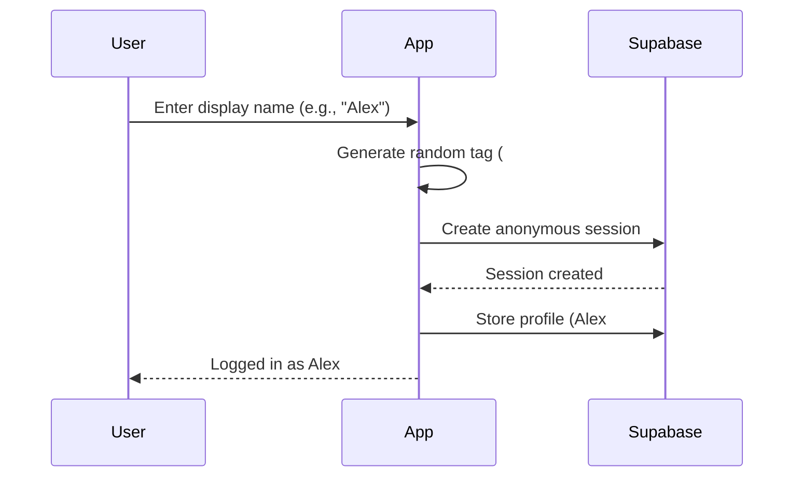

<div align="center">

# 💬 Roomy

**Anonymous Real-Time Chat Rooms**

A modern, privacy-focused chat application with Discord-style usernames, password-protected rooms, and real-time messaging. No email required—just pick a name and start chatting!

[](https://supabase.com)
[](https://react.dev)
[](https://www.typescriptlang.org/)
[](https://vitejs.dev)

[Features](#-features) • [Demo](#-demo) • [Quick Start](#-quick-start) • [Architecture](#-architecture) • [Deployment](#-deployment)

</div>

---

## ✨ Features

<table>
<tr>
<td width="50%">

### 🎭 Anonymous & Secure
- **No Email Required** – Start chatting instantly
- **Discord-Style Names** – Unique tags (e.g., `Alex#1234`)
- **Password Protection** – 6-character auto-generated passwords
- **Global Join** – Join any room with just a password
- **Row-Level Security** – PostgreSQL RLS policies

</td>
<td width="50%">

### 💬 Real-Time Collaboration
- **Instant Messaging** – Powered by Supabase Realtime
- **Live Presence** – See who's online in real-time
- **File Sharing** – Upload images & files (5MB limit)
- **Image Previews** – Inline display with lightbox
- **Room Capacity** – Max 15 members per room

</td>
</tr>
<tr>
<td width="50%">

### 🛠️ Developer Experience
- **TypeScript** – Full type safety
- **Modern Stack** – React 18 + Vite 5
- **Beautiful UI** – shadcn/ui + Tailwind CSS
- **Hot Module Replacement** – Fast development
- **ESLint** – Code quality checks

</td>
<td width="50%">

### ⚡ Performance & Efficiency
- **Auto-Cleanup** – 7-day data retention (free tier friendly)
- **Database Triggers** – Automated member counts
- **Optimized Queries** – Foreign key indexes
- **Responsive Design** – Mobile-first approach
- **Efficient Updates** – Realtime + polling hybrid

</td>
</tr>
</table>

---

## 🎬 Demo

> Add screenshots or screen recordings here

```bash
# Try it yourself in under 5 minutes!
git clone https://github.com/Hayvi/roomy.git
cd roomy
npm install && npm run dev
```

---

## 🛠️ Tech Stack

### Frontend
| Technology | Version | Purpose |
|------------|---------|---------|
| [React](https://react.dev) | 18.3 | UI framework |
| [TypeScript](https://www.typescriptlang.org/) | 5.8 | Type safety |
| [Vite](https://vitejs.dev) | 5.4 | Build tool & dev server |
| [Tailwind CSS](https://tailwindcss.com) | 3.4 | Utility-first styling |
| [shadcn/ui](https://ui.shadcn.com) | — | Component library |
| [React Router](https://reactrouter.com) | 6.30 | Client-side routing |
| [Lucide React](https://lucide.dev) | 0.462 | Icon library |
| [date-fns](https://date-fns.org) | 3.6 | Date formatting |
| [Sonner](https://sonner.emilkowal.ski/) | 1.7 | Toast notifications |

### Backend (Supabase)
| Service | Purpose |
|---------|---------|
| **Authentication** | Anonymous auth with custom display names |
| **Database** | PostgreSQL with Row-Level Security |
| **Realtime** | WebSocket subscriptions for live updates |
| **Storage** | File uploads (images & attachments) |
| **Edge Functions** | Serverless API endpoints (if needed) |

### Security & Database
- **pgcrypto** – Password hashing with bcrypt
- **RLS Policies** – Row-level security on all tables
- **Triggers** – Auto-update member counts & capacity enforcement
- **Indexes** – Foreign key indexes for performance

---

## 📋 Prerequisites

Before you begin, ensure you have:

- **Node.js** ≥ 18 ([nvm](https://github.com/nvm-sh/nvm) recommended)
- **npm** ≥ 9
- **Supabase Account** – [Sign up free](https://supabase.com)
- **Supabase CLI** – Install via `npm i -g supabase` or use `npx supabase`

---

## 🚀 Quick Start

### 1. Clone & Install Dependencies

```bash
git clone https://github.com/Hayvi/roomy.git
cd roomy
npm install
```

### 2. Set Up Supabase Project

#### Option A: Create New Project (Recommended)
```bash
# Login to Supabase
npx supabase login

# Initialize new project
npx supabase init

# Link to a new Supabase project
npx supabase link --project-ref <your-project-ref>
```

#### Option B: Use Existing Project
```bash
npx supabase link --project-ref <your-project-ref>
```

### 3. Configure Environment Variables

```bash
cp .env.example .env
```

Edit `.env` with your Supabase credentials:
```env
VITE_SUPABASE_URL=https://your-project.supabase.co
VITE_SUPABASE_PUBLISHABLE_KEY=your-anon-key
```

> 💡 Find these in your [Supabase Dashboard](https://supabase.com/dashboard) → Project Settings → API

### 4. Apply Database Migrations

```bash
npx supabase db push
```

This creates:
- 📊 **Tables**: `profiles`, `rooms`, `room_members`, `messages`, `room_secrets`
- 🔒 **RLS Policies**: Secure row-level access control
- ⚙️ **Functions**: `join_room()`, `create_room()`, `check_room_capacity()`
- 🗂️ **Storage**: `chat-attachments` bucket
- ⏰ **Cron Job**: Auto-cleanup every 7 days
- 🔄 **Triggers**: Member count updates, capacity enforcement

### 5. Start Development Server

```bash
npm run dev
```

Visit **http://localhost:8080** (or the port shown in terminal)

🎉 **You're ready to chat!**

---

## 📚 How It Works

### 🎭 Anonymous Authentication Flow



### 🔐 Creating a Room

1. User enters room name
2. App generates 6-character password (e.g., `x7k9p2`)
3. Password is hashed using `pgcrypto.crypt()`
4. Hash stored in `rooms.password_hash`
5. Plaintext stored in `room_secrets` (for owner to share)
6. Creator automatically added as first member

### 💬 Joining a Room

1. User enters password
2. `join_room(room_id, password)` RPC called
3. Database verifies password hash
4. Checks room capacity (max 15 members)
5. Adds user to `room_members` table
6. User sees messages and can chat

### 📎 File Sharing

1. User clicks paperclip icon
2. File validated (max 5MB, allowed types)
3. Uploaded to Supabase Storage (`chat-attachments`)
4. URL stored in `messages.file_url`
5. Images displayed inline; others as download links

### 🧹 Auto-Cleanup (7-Day Retention)

```sql
-- Runs daily at 3:00 AM UTC
SELECT cron.schedule(
  'cleanup-old-data',
  '0 3 * * *',
  $$ SELECT cleanup_old_data(); $$
);
```

Automatically deletes:
- Rooms older than 7 days
- Associated messages, members, and storage files
- Keeps database within free tier limits

---

## 🏗️ Architecture

### Database Schema

```
┌─────────────┐     ┌──────────────┐     ┌───────────────┐
│   profiles  │     │    rooms     │     │ room_members  │
├─────────────┤     ├──────────────┤     ├───────────────┤
│ id (PK)     │──┐  │ id (PK)      │──┬──│ room_id (FK)  │
│ display_name│  │  │ name         │  │  │ user_id (FK)  │
│ created_at  │  │  │ owner_id (FK)│──┘  │ joined_at     │
└─────────────┘  │  │ password_hash│     │ last_seen_at  │
                 │  │ member_count │     └───────────────┘
                 │  │ created_at   │
                 │  └──────────────┘
                 │
                 │  ┌──────────────┐
                 │  │   messages   │
                 │  ├──────────────┤
                 └──│ user_id (FK) │
                    │ room_id (FK) │
                    │ content      │
                    │ file_url     │
                    │ created_at   │
                    └──────────────┘
```

### Key Features Implementation

#### Room Capacity Limit (15 members)
```sql
-- Trigger on room_members INSERT
CREATE TRIGGER enforce_room_capacity
  BEFORE INSERT ON room_members
  FOR EACH ROW
  EXECUTE FUNCTION check_room_capacity();
```

#### Password Security
- Hashed with `bcrypt` (12 rounds)
- Verified server-side only
- Never exposed to client

#### Real-Time Updates
- **Realtime subscriptions** for table changes
- **Polling** (5s) for online counts
- **Presence tracking** via heartbeat

---

## 📦 Available Scripts

| Command | Description |
|---------|-------------|
| `npm run dev` | Start Vite dev server with HMR |
| `npm run build` | Production build → `dist/` |
| `npm run preview` | Preview production build locally |
| `npm run lint` | Run ESLint checks |
| `npm run build:dev` | Development build variant |

---

## 🌐 Deployment

### Build for Production

```bash
npm run build
```

Outputs to `dist/` folder.

### Deploy to Static Hosting

#### Vercel
```bash
npm i -g vercel
vercel --prod
```

#### Netlify
```bash
npm i -g netlify-cli
netlify deploy --prod --dir=dist
```

#### Cloudflare Pages
```bash
npx wrangler pages deploy dist
```

### Environment Variables

Ensure your hosting platform has these set:
```env
VITE_SUPABASE_URL=https://your-project.supabase.co
VITE_SUPABASE_PUBLISHABLE_KEY=your-anon-key
```

---

## 🔧 Troubleshooting

### Database Migration Fails

**Issue:** `supabase db push` returns errors

**Solutions:**
1. Check Supabase project is active
2. Verify project ref: `npx supabase projects list`
3. Run migrations individually:
   ```bash
   npx supabase migration up
   ```

### "Incorrect Password" Error

**Issue:** Cannot join rooms even with correct password

**Check:**
1. Ensure `pgcrypto` extension is enabled
2. Verify `join_room` function uses `extensions.crypt()`
3. Check database logs in Supabase Dashboard

### Real-Time Not Working

**Issue:** Messages don't appear instantly

**Solutions:**
1. Check Supabase Realtime is enabled (Dashboard → Settings → API)
2. Verify WebSocket connection in browser DevTools
3. Check RLS policies allow access

### File Upload Fails

**Issue:** Cannot upload images/files

**Check:**
1. Storage bucket `chat-attachments` exists
2. RLS policies on `storage.objects` are correct
3. File is under 5MB
4. File type is allowed (check `MessageInput.tsx`)

---

## 🗂️ Project Structure

```
roomy/
├── src/
│   ├── components/
│   │   ├── ui/              # shadcn/ui components
│   │   ├── ChatMessage.tsx  # Message display
│   │   ├── MessageInput.tsx # Input with file upload
│   │   ├── RoomList.tsx     # Room list sidebar
│   │   └── ...
│   ├── pages/
│   │   ├── Auth.tsx         # Anonymous sign-in
│   │   ├── Index.tsx        # Room list page
│   │   ├── Room.tsx         # Chat room page
│   │   └── NotFound.tsx     # 404 page
│   ├── integrations/
│   │   └── supabase/
│   │       └── client.ts    # Supabase client setup
│   ├── lib/
│   │   ├── constants.ts     # App constants
│   │   └── utils.ts         # Utility functions
│   ├── hooks/
│   │   ├── use-toast.ts     # Toast notifications
│   │   └── use-mobile.tsx   # Mobile detection
│   ├── App.tsx              # Router setup
│   └── main.tsx             # App entry point
├── supabase/
│   └── migrations/          # Database migrations
├── public/                  # Static assets
├── .env.example             # Environment template
├── package.json
├── tsconfig.json
└── vite.config.ts
```

---

## 🤝 Contributing

Contributions are welcome! Here's how:

1. **Fork** the repository
2. **Clone** your fork: `git clone https://github.com/YOUR_USERNAME/roomy.git`
3. **Create** a branch: `git checkout -b feat/amazing-feature`
4. **Make** your changes
5. **Commit** using [Conventional Commits](https://www.conventionalcommits.org/):
   - `feat:` New feature
   - `fix:` Bug fix
   - `docs:` Documentation
   - `style:` Formatting
   - `refactor:` Code refactoring
   - `perf:` Performance improvement
   - `test:` Tests
6. **Push** and create a **Pull Request**

### Development Guidelines
- Follow existing code style
- Add TypeScript types for everything
- Test your changes locally
- Update documentation if needed

---

## 📄 License

This project is licensed under the **MIT License**.

---

## 🙏 Acknowledgments

Built with these amazing technologies:
- [Supabase](https://supabase.com) – Backend infrastructure
- [React](https://react.dev) – UI framework
- [Vite](https://vitejs.dev) – Build tool
- [shadcn/ui](https://ui.shadcn.com) – Component library
- [Tailwind CSS](https://tailwindcss.com) – Styling

---

## 📞 Support

- 🐛 **Issues**: [GitHub Issues](https://github.com/Hayvi/roomy/issues)
- 💬 **Discussions**: [GitHub Discussions](https://github.com/Hayvi/roomy/discussions)
- 📧 **Email**: [your-email@example.com](mailto:your-email@example.com)

---

<div align="center">

**Built with ❤️ using Supabase, React, and TypeScript**

⭐ Star this repo if you find it useful!

</div>
